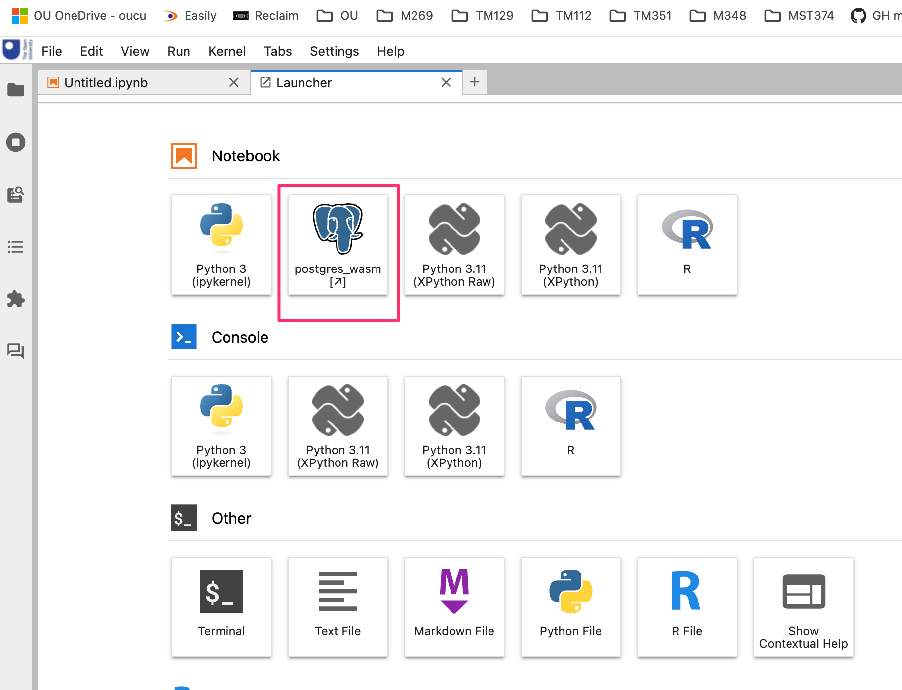

# Using with Jupyter Server-Proxy

Repackage the original demo so it runs via `jupyter-server-proxy`, adding a JupyterLab launcher button that will open the postgres-wasm demo into a new browser tab. *[How do we add this button to "Other" rather than "Notebook" area?]*

`pip install .`